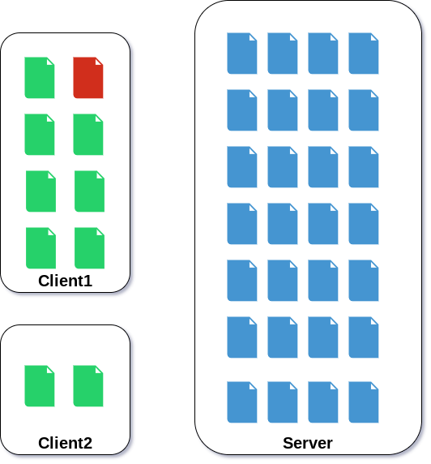
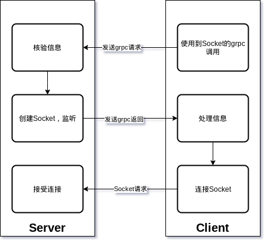
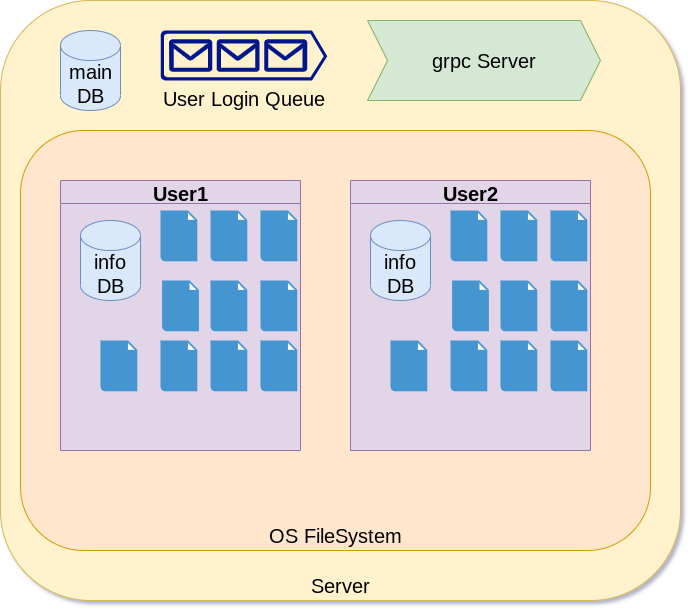

# MDSync - Markdown及其附件的同步

> 数据库期末项目

| 姓名   | 学号     | 联系方式           |
| ------ | -------- | ------------------ |
| 张烨禧 | 18340216 | zetako@outlook.com |
| 钟赫明 | 18340224 | zhonghm5@mail2.sysu.edu.cn |

[TOC]

## 1. 项目背景与简介

> 提纲：
>
> 1. md的简介
> 2. md同步的问题

### 1.1 Markdown

与常用的商用文稿编辑软件，如Word、WPS、Pages等等相比，Markdown在标准公开、格式简洁上有着独特的优势，所以许多人喜欢使用Markdown来完成自己平时的文稿编辑、记录。

### 1.2 问题：Markdown的同步

商用软件中很多都有其自带的、基于相关账号或者云服务的多终端同步机制，如Word基于OneDrive和微软账号进行同步、WPS基于WPS账号、Pages基于iCloud和Apple账号。相比之下Markdown则缺乏类似的功能。而且，因为Markdown通常是以超链接的形式引用其他的多媒体文件的，所以这可能会给同步带来许多困难。

## 2. 项目研究内容（需求分析）

> 提纲：
>
> 1. 跨设备同步
> 2. 附件同步
> 3. 浏览文件

### 2.1 跨设备同步

Markdown作为一种追求专注的文件格式，其比较常见的使用方式是用来当作笔记。在不同的环境下，我们会需要使用到不同的设备进行记录；我们很自然的会希望这些记录的笔记可以随时在另一个设备中访问，修改等。当然，我们可以使用各种文件同步服务或云存储进行同步，然而当前的众多云存储服务并未对Markdown进行优化，他们只会将Markdown当作普通的文件进行同步，这样的操作欠缺灵活性。因此，我们需要一款专为同步Markdown设计的软件，并且它应该能支持各种各样的平台。

### 2.2 附件同步

一般来说，Markdown文件是一个纯文本文件；但是，我们在使用文件的过程中，不可避免的会引入一些多媒体资源，例如图片，视频等。对于这样的需求，Markdown给出的解决方案是超链接：利用URL将目标文件引入到Markdown中；通常来说，用户指定的链接会是一个相对URL,也就是指向本地某个文件的URL，这样的做法就导致了我们要同步Markdown时，必须将Markdown引用的其他资源也一并同步，并且还必须保持他们的相对位置不变，才能使其正常指向目标。因此，我们希望我们的服务能够在同步Markdown的同时，将其相关附件进行同步。

### 2.3 文件预览

很多时候，我们只是希望阅读Markdown文件，并不希望将文件下载后再打开，因此这个Markdown同步服务最好能够提供Markdown的预览功能。很遗憾的是，由于Markdown文件的纯文本属性，当前的大量同步服务都仅仅将其当作一个普通的文本文件打开，这不利于我们阅读。因此我们的服务最好能够提供一个云端预览的功能，以方便用户使用。

## 3. 技术路线与体系结构（包含数据库设计）

> 提纲：
>
> 1. 技术路线（就是开发路线）
> 2. 体系结构
>    1. 客户端
>    2. 服务端
> 3. 数据库设计（可以合在服务端中）

### 3.1 技术路线

#### 3.1.1 通讯模型

##### 3.1.1.1 基础概念

首先，作为一款同步软件，我们需要先构筑最基本的通讯模型。

我们的同步服务采用C-S结构，数据主要在服务端存储，在客户端缓存一部分。



图中展示了两个客户端访问服务器的情况，其中绿色表示有效副本，红色表示无效副本。客户端1首先需要将无效副本更新到有效；然后两个客户端都需要根据访问情况，决定是使用本地副本还是使用在线副本。

##### 3.1.1.2 通讯协议

涉及到具体的通讯方式，我们选择使用grpc+TCP的通讯方式。

grpc是一个基于protobuf的RPC（远程调用方法）的实现，它有多种语言的API，可以保证在不同语言间的程序有相同的通信内容。由于我们可能需要支持多个平台，而在不同的平台上可能有不同的推荐语言（例如安卓上使用Java,IOS上使用OC等），因此一种有效的跨语言的通信方式是我们所需要的。我们将CS间的大部分的通讯都用grpc实现，这样，需要接入任何一个平台时，就可以不受到通讯协议的限制来选择实现语言。下面列出了我们的初期Demo使用到的grpc方法。

```protobuf
service serviceMDSync
{
    rpc login(loginInfo) returns (response);
    rpc getDirInfo(request) returns (stream fileInfo);
    rpc getFileInfo(request) returns (fileInfo);
    rpc fileOperation(request) returns (response);
    rpc uploadReq(request) returns (socketInfo);
    rpc downloadReq(request) returns (socketInfo);
    rpc newFileReq(request) returns (socketInfo);
    rpc getFileTree(request) returns (JSONString);
    rpc getTimeStamp(request) returns (JSONString);
};
```

而TCP则主要用来传输文件。由于上述的grpc作为一个RPC的实现，在传输大量数据上并没有很明显的优势，因此这里我们使用到最基础的一个TCP通讯协议来进行文件的传输，最大限度的保证兼容性。基本上，我们的TCP传输是由服务端进行监听，由客户端进行连接的；一个基本的流程如下图所示，首先由客户端发起某个需要用到Socket的请求，然后服务端准备好Socket连接的时候就发送连接所需的信息，最后由客户端去连接服务端提供的Socket，一个Socket就建立完成了。



##### 3.1.1.3 语言选择

基于上述的技术，其实有多种语言可以选择；我们最初决定实现的是PC端（Windows/Linux/MacOS）的一套系统，因此我们的语言选择比较偏向于一些能够跨系统的语言。最后我们选择Node.js进行服务端的开发，并且选择基于Node.js的Electron进行服务端的开发。理由如下：

- Node.js的生态强大，有大量的完善的框架使用
- Node.js有一套完善的异步处理机制，这有利于我们这种长期驻守，并且比较注重IO的服务器的开发
- Electron由于其基于Web技术的特性，天生有强大的跨平台支持

#### 3.1.2 同步检测

完成了基础的通讯模型之后，我们需要实现一个比较重要的功能：同步检测。同步检测指的是我们检测目标是否有本地缓存，本地缓存是否过期，是否需要提供对目标的更新等；要实现这个功能，我们初期使用的是时间戳的方式。

- 每个节点（文件/文件夹）都有一个时间戳的属性；
- 服务器自身有一个总体的时间戳，并且我们保证这个时间戳是单调递增的；
- 每次我们执行改变文件结构的操作，更新这个文件的时间戳为当前服务器的时间戳，并且递归更新它的父目录的时间戳；
- 客户端保存一个时间戳，当这个时间戳落后于服务端提供的时间，说明本地资源列表过期，从服务器拉取新的资源列表；
- 客户端每次访问一个文件，比较本地缓存的时间戳和资源列表的时间戳，若落后，说明本地缓存过期，需要重新拉取

#### 3.1.3 文件拓展

有了上述的两个实现，我们就构造了一个稳定的同步系统；接下来，我们着手实现需求分析中提到的附件同步。附件同步的基础是文件解析；这个操作主要在客户端实现。注意到Markdown的任何外部链接都是以一个固定的格式指出的：

```
[title](URL)

```

因此我们要做的事情非常明确：

1. 上传一个Markdown文件时，解析文件，提取出所有` []() `的组合
2. 解析其中的URL，同样加入上传列表
3. 下载一个Markdown文件时，解析文件，提取出所有` []() `的组合
4. 解析其中的URL,同样加入下载列表

#### 3.1.4 拆分文件

注意到Markdown文件是纯文本的文件，因此我们其实没有必要每次都同步整个文件；类似于Git，我们只需要传输“文件修改记录”就完成了文件的同步；这种同步方法可以大大的提升我们的同步效率。

但是使用这种方法，就意味着我们的服务端不能将Markdown文件作为一个完整的文件来储存，而是要记录文件及其修改记录，才能做到在客户端需要是提供其修改记录。

### 3.2 服务端设计

#### 3.2.1 整体设计

服务端的主体是一个grpc服务器，一个用户管理队列，一个服务器数据的数据库以及存储用户信息的OS文件系统和记录用的数据库。



- 所有的请求都是通过grpc服务器接受的；
  - grpc方法绑定有不同的函数，grpc服务器根据请求，调用对应的函数执行功能；
- 服务器的相关信息（例如时间戳）写入到mainDB中，保证服务器失效后迅速恢复；
- 用户的登陆队列由队列管理器管理，及时踢出超时或失效的用户
  - 实际上，该队列是这样一个Map实例：` uuid->{username,TTL}`
  - 也就是说，每次用户登陆时，分配一个UUID
  - 用户通过这个UUID来访问资源时，系统查找队列来找到用户
  - 综上，可以通过管理这个Map来实现用户的访问权限管理
- 用户的文件以OS提供的FS API进行存储
  - 实际上使用的是模块`fs-extra`
  - 每个用户有一个文件夹，作为自己的根目录
  - 每个用户有一个数据库记录自己的文件

#### 3.2.2 数据库设计

##### 3.2.2.1 数据库访问

基于方便部署的原则，该服务端的数据库不使用MySQL/MariaDB这类需要额外部署的数据库，而是使用SQLite3：

- 该数据库不需要部署，数据库存储本身作为FS的一个文件存在，而访问接口作为编程语言的一个函数存在
- 该数据库依旧能使用“较为完整规范”的SQL语句进行查询

同时，我们不使用官方提供的`node-sqlite3`模块，而是使用第三方的`better-sqlite3`，有如下理由：

- 该模块提供的接口是同步函数，不会造成过长的回调函数链
- 该模块的操作效率比较高

##### 3.2.2.2 主数据库

主数据库中有两张表：

- user（记录用户信息）
  - name：变长字符串，存储用户名
  - passwd：变长字符串，存储用户密码
- property（记录服务器属性）
  - name：变长字符串，记录属性名
  - value：变长字符串，存储属性值

前者用来记录用户信息，然后在登陆的时候可以进行查找比对；同时，也需要通过遍历这张表来维护runtime的完整性。

##### 3.2.2.3 用户数据库

用户数据库中只有一张表：

- file（记录文件的表）
  - id：整数；节点的ID,是主码，同时由数据库管理，自增
  - name：变长字符串；节点的名字
  - type：变长字符串；节点的类型（文件夹/Markdown文件/其他文件）
  - path：变长字符串；节点的完整路径，方便访问
  - parent：整数；记录父节点的ID
  - timestamp：整数；记录文件最后一次修改对应的时间戳

### 3.3 客户端设计

## 4. 系统环境（软硬件环境）

> 提纲：
>
> 1. 客户端
> 2. 服务端

### 4.1 服务端

当前的服务端可以运行在任何装有Node.js环境的计算机中。但是由于部分依赖的模块需要关联到其他语言编译的动态库（例如：`better-sqlite3`需要C/C++编译），部署的计算机需要有相对应的编译工具链。基于未来可能的接入systemctl系统的需求，建议的部署环境是以systemctl方式进行初始化的Linux系统。

当前的服务端在Linux以及MacOS上测试通过。

### 4.2 客户端

## 5. 系统功能设计

> 提纲：
>
> 1. 按照grpc的请求来写？

## 6. 总结

